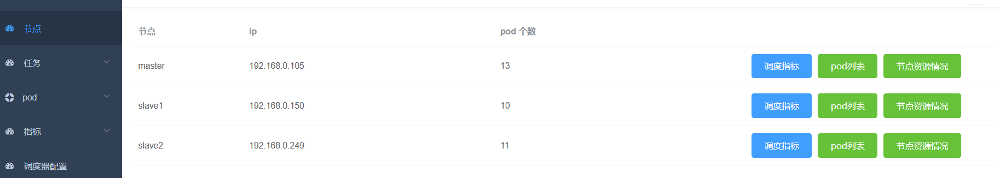
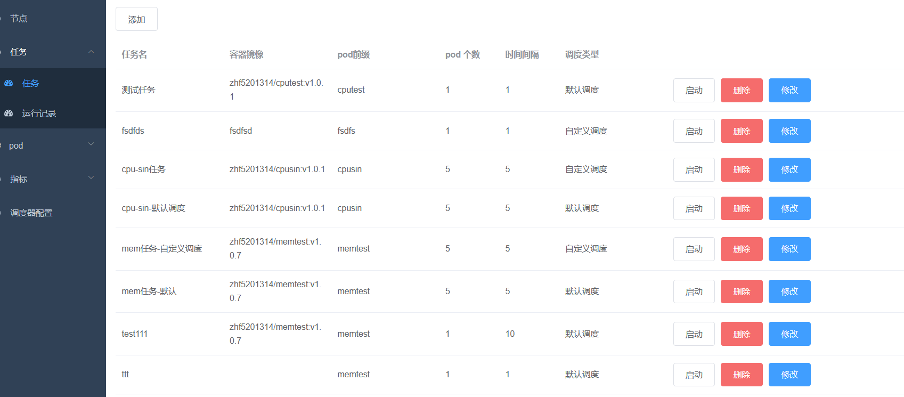
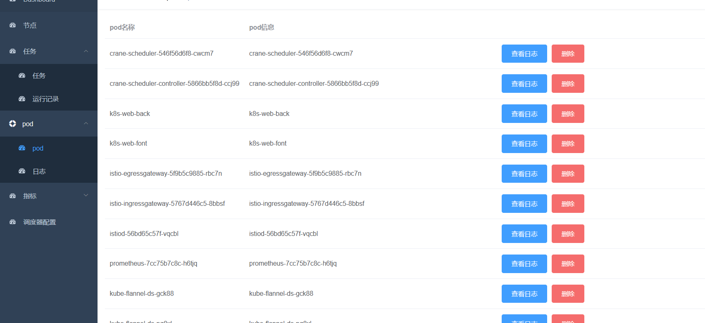
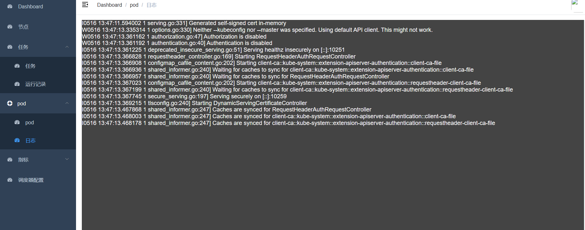
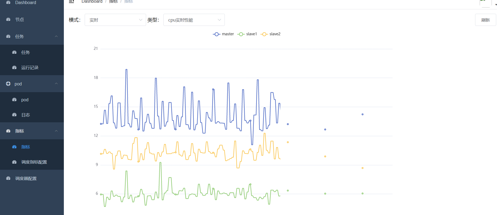

# k8s任务调度测试平台
1. 指标监控
2. 任务定义，启动/停止，在线代码编写，调度结果持久化，可视化
3. 节点管理
4. pod管理

效果图：










> 部署脚本
1. 后端
```yaml
apiVersion: v1
kind: Pod
metadata:
  labels:
    app: k8s-web-back
  name: k8s-web-back
  namespace: default
spec:
  containers:
    - command:
        - java
        - -jar
        - /app.jar
        - --spring.profiles.active=pro
      image: zhf5201314/k8s-web-backen:v1.0.2
      imagePullPolicy: IfNotPresent
      name: k8s-web-backen
      ports:
        - containerPort: 8093
          name: http
      env:
        - name: PROMETHEUS_API
          value: http://prometheus-k8s.monitoring:9090

---

apiVersion: v1
kind: Service
metadata:
  name: service-k8s-web-back

spec:
  ports:
    - name: name-of-service-port
      port: 8093
      protocol: TCP
      targetPort: http
  selector:
    app: k8s-web-back
  type: ClusterIP
```

2. 前端
```yaml
apiVersion: v1
kind: Pod
metadata:
  labels:
    app: k8s-web-font
  name: k8s-web-font
  namespace: default
spec:
  containers:
    - image: zhf5201314/k8s-web-front:v1.0.1
      imagePullPolicy: IfNotPresent
      name: k8s-web-font
      ports:
        - containerPort: 80
          name: http

---

apiVersion: v1
kind: Service
metadata:
  name: service-k8s-web-font

spec:
  ports:
    - name: name-of-service-port
      port: 80
      protocol: TCP
      targetPort: http
  selector:
    app: k8s-web-font
  type: ClusterIP 
```